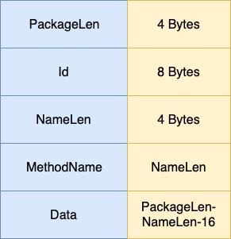
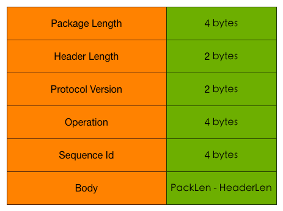

# cppim

使用C++重新实现goim，网络库基于asio，rpc基于protobuf。

## RPC协议格式

Id最高位为RPC标志位，0表示request，1表示response。

## Gate协议格式

**请求&返回参数**

| 参数名     | 必选  | 类型 | 说明       |
| :-----     | :---  | :--- | :---       |
| package length        | true  | int32 bigendian | 包长度 |
| header Length         | true  | int16 bigendian    | 包头长度 |
| ver        | true  | int16 bigendian    | 协议版本 |
| operation          | true | int32 bigendian | 协议指令 |
| seq         | true | int32 bigendian | 序列号 |
| body         | false | binary | $(package lenth) - $(header length) |

| 指令     | 说明  | 
| :-----     | :---  |
| 2 | 客户端请求心跳 |
| 3 | 服务端心跳答复 |
| 5 | 下行消息 |
| 7 | auth认证 |
| 8 | auth认证返回 |